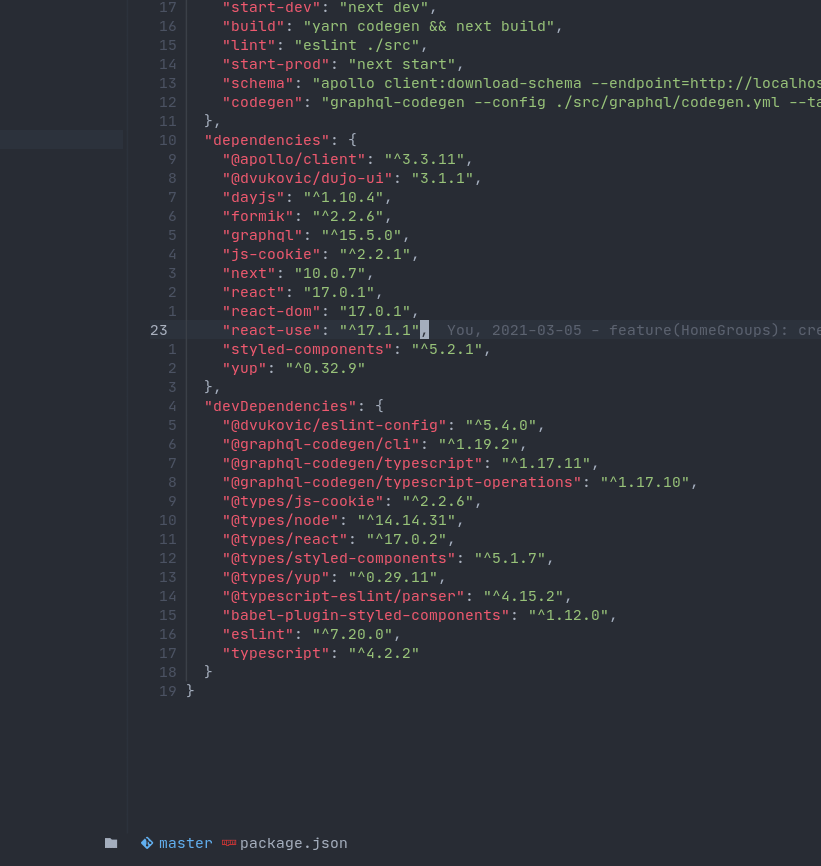

<div align="center">


## All the `npm`/`yarn` commands I don't want to type

</div>

<div align="center">


</div>

<div align="center">


</div>

## ✨ Features

- Display latest package versions as virtual text
- Upgrade package on current line to latest version
- Delete package on current line
- Install a different version of a package on current line
- Install new package
- Reinstall dependencies
- Automatic package manager detection
- Loading animation hook (to be placed in status bar or anywhere else)

<div align="center">

### Display Latest Package Version

Runs `npm outdated --json` in the background and then compares the output with versions in `package.json`



</div>

#### Keybindings

```lua
vim.api.nvim_set_keymap(
    "n",
    "<leader>ns",
    "<cmd>lua require('package-info').show()<cr>",
    { silent = true, noremap = true }
)
```

- **NOTE:** after the first outdated dependency fetch, it will show the cached results for the next hour instead of re-fetching every time.
- If you would like to force re-fetching every time you can provide `force = true` like in the example below:

```lua
vim.api.nvim_set_keymap(
    "n",
    "<leader>ns",
    "<cmd>lua require('package-info').show({ force = true })<cr>",
    { silent = true, noremap = true }
)
```

## 🚀 Planned Features

- Install new packages through search popup [#26](https://github.com/vuki656/package-info.nvim/issues/26)
- Upgrade package on current line [#21](https://github.com/vuki656/package-info.nvim/issues/21)
- Install custom package version through popup [#24](https://github.com/vuki656/package-info.nvim/issues/24)
- Delete package on current line [#23](https://github.com/vuki656/package-info.nvim/issues/23)
- Set package manager [#22](https://github.com/vuki656/package-info.nvim/issues/22)

## ⚡️ Requirements

- Neovim >= 0.5.0
- Npm
- [Patched font](https://github.com/ryanoasis/nerd-fonts/tree/gh-pages) if you
  want icons

## 📦 Installation

### [packer](https://github.com/wbthomason/packer.nvim)

```lua
use({
    "vuki656/package-info.nvim",
    requires = "MunifTanjim/nui.nvim",
})
```

## ⚙️ Configuration

### Usage

```lua
require('package-info').setup()
```

### Defaults

```lua
{
    colors = {
        up_to_date = "#3C4048", -- Text color for up to date package virtual text
        outdated = "#d19a66", -- Text color for outdated package virtual text
    },
    icons = {
        enable = true, -- Whether to display icons
        style = {
            up_to_date = "|  ", -- Icon for up to date packages
            outdated = "|  ", -- Icon for outdated packages
        },
    },
    autostart = true -- Whether to autostart when `package.json` is opened
    hide_up_to_date = true -- It hides up to date versions when displaying virtual text
    -- Can be `npm` or `yarn`. Used for `delete`, `install` etc...
    -- The plugin will try to auto-detect the package manager based on
    -- `yarn.lock` or `package-lock.json`. If none are found it will use the
    -- provided one, if nothing is provided it will use `yarn`
    package_manager = `yarn`
}
```

-- **NOTE:** if `autostart` is on, `package-info` will run the first `fetch`, and then won't run the `fetch`
operation for another hour to prevent unnecessary calls.

If you want to force the refetch you can use the following command:

```lua
-- Display latest versions as virtual text
vim.api.nvim_set_keymap(
    "n",
    "<leader>ns",
    "<cmd>lua require('package-info').show({ force = true })<cr>",
    { silent = true, noremap = true }
)
```

### ⏰ Loading Hook

- `package-info` provides a hook to display a loading message


#### Config

- It can be used anywhere in `neovim` by invoking `return require('package-info').get_status()`

```lua
local package = require("package-info")

-- Galaxyline
section.left[10] = {
    PackageInfoStatus = {
        provider = function()
            return package.get_status()
        end,
    },
}
```

#### 256 Color Terminals

- If the vim option `termguicolors` is false, package-info switches to 256 color mode.
- In this mode [cterm color numbers](https://jonasjacek.github.io/colors/) are used
  instead of truecolor hex codes and the color defaults are:

```lua
colors = {
    up_to_date = "237", -- cterm Grey237
    outdated = "173", -- cterm LightSalmon3
}
```

## ⌨️ Keybindings

**Package info has no default Keybindings**.

You can copy the ones below:

```lua
-- Display latest versions as virtual text
vim.api.nvim_set_keymap("n", "<leader>ns", "<cmd>lua require('package-info').show({ force = true })<cr>",
  { silent = true, noremap = true }
)

-- Clear package info virtual text
vim.api.nvim_set_keymap("n", "<leader>nc", "<cmd>lua require('package-info').hide()<cr>",
  { silent = true, noremap = true }
)


-- Delete package on current line
vim.api.nvim_set_keymap("n", "<leader>nd", "<cmd>lua require('package-info').delete()<cr>",
  { silent = true, noremap = true }
)

-- Update package on current line
vim.api.nvim_set_keymap("n", "<leader>nu", "<cmd>lua require('package-info').update()<cr>",
  { silent = true, noremap = true }
)
```

## 📝 Notes

- Display might be slow on a project with a lot of packages. This is due to the
  `npm outdated` command taking a long time. Nothing can be done about that

- Idea was inspired by [akinso](https://github.com/akinsho) and his [dependency-assist.nvim](Dependency-assist.nvim)

- Readme template stolen from [folke](https://github.com/folke)

- This is my first `neovim` plugin so please don't hesitate to
  open an issue an tell me if you find anything stupid in the code :D.
